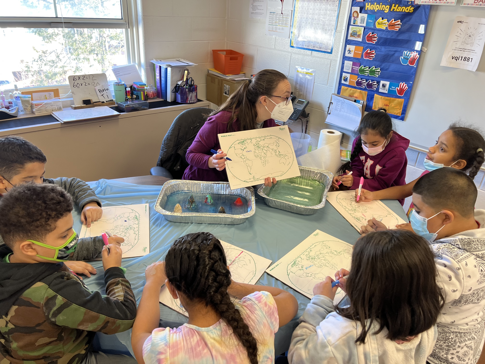

# Sarah Nickford
 
## Education
[Univeristy of Rhode Island- Graduate School of Oceanography](https://web.uri.edu/gso/)

[Stony Brook University](https://www.stonybrook.edu)

## Research interests
Using physical oceanography to answer interdisciplinary questions. I am currently studying the wintertime exchange of carbon dioxide at the air-sea interface using Uncrewed Surface Vehicles. 
